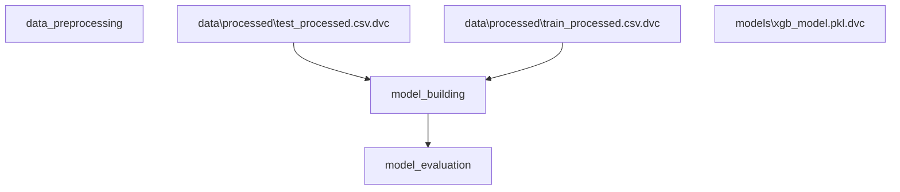

```mermaid
flowchart TD
	node1["data_preprocessing"]
	node2["data\processed\test_processed.csv.dvc"]
	node3["data\processed\train_processed.csv.dvc"]
	node4["model_building"]
	node5["model_evaluation"]
	node2-->node4
	node3-->node4
	node4-->node5
	node6["models\xgb_model.pkl.dvc"]
```